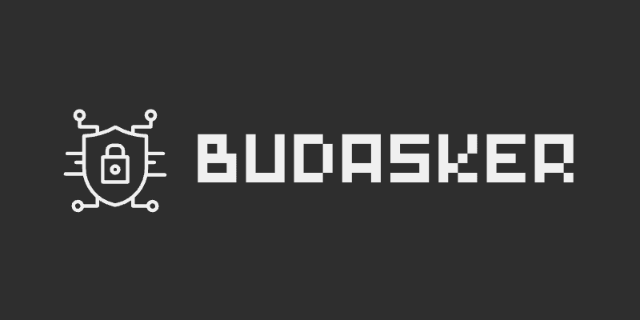

# About


<p align="center">
  
</p>

## Descripción

Este es un proyecto que hace cosas increíbles y tiene como objetivo [explicar brevemente qué hace el proyecto]. ¡Es superútil!

### Funcionalidades:
- Funcionalidad 1
- Funcionalidad 2
- Funcionalidad 3

## Cómo usarlo

1. Clona el repositorio
    ```bash
    git clone https://github.com/Budasker/budasker.git
    ```
2. Sigue los pasos de instalación.
3. Ejecuta el proyecto con:

    ```bash
    ./run-proyecto
    ```

## Contribuciones

Si quieres contribuir, sigue estos pasos:

1. Forkea el repositorio.
2. Crea una nueva rama para tus cambios.
3. Realiza tus modificaciones.
4. Haz un pull request para revisarlo.

## Licencia

Este proyecto tiene licencia [MIT](https://opensource.org/licenses/MIT).

---

¡Gracias por ver el proyecto! 😎
